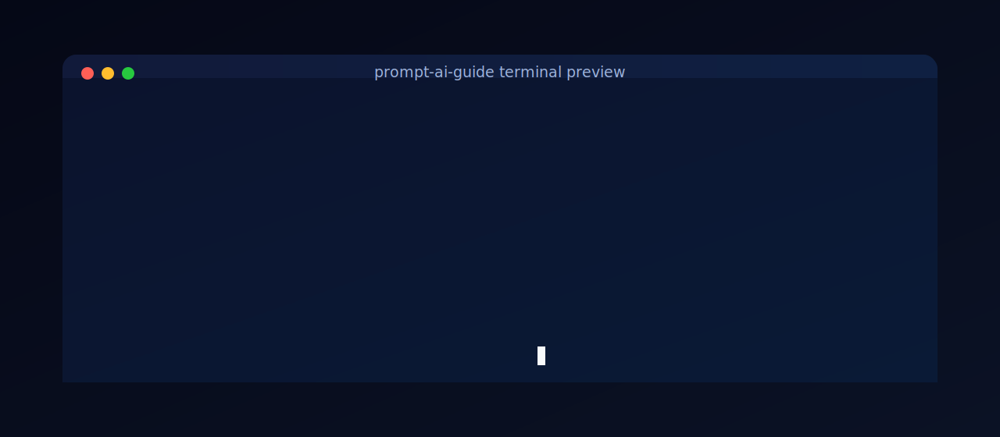

# prompt-ai-guide

Reusable open-source starter kit for `prompt.ai` workflow + Cursor rules.



### Copy-paste starter prompt

<details open>
  <summary><strong>ChatGPT-style prompt</strong></summary>

```text
Fetch and analyze this repository first:
https://github.com/MooseQuest/prompt-ai-guide

Then implement the same prompt.ai workflow in my project.

Requirements:
- Create prompt.ai/development_log.md and prompt.ai/git_workflow.md
- Create .cursor/rules/prompt-ai.mdc and .cursor/rules/git-commit.mdc
- Add prompt.ai/research/README.md for LLM-generated guidance artifacts
- Update README.md and CONTRIBUTING.md to reference these files
- Add durable guidance to prompt.ai/research/ and keep session scratch notes local
```
</details>

<details>
  <summary><strong>Claude-style prompt</strong></summary>

```text
Please review and apply the prompt-ai-guide pattern from:
https://github.com/MooseQuest/prompt-ai-guide

Set up the same structure in this repository:
1) prompt.ai/development_log.md
2) prompt.ai/git_workflow.md
3) .cursor/rules/prompt-ai.mdc
4) .cursor/rules/git-commit.mdc
5) prompt.ai/research/README.md

Also update README/CONTRIBUTING references and record the setup in
prompt.ai/research/ and local session notes.
```
</details>

## What this gives you

- `prompt.ai` folder for development logs and release summaries
- `prompt.ai/research` for LLM-generated guidance and analysis artifacts
- `.cursor/rules` guidance for consistent AI-assisted workflows
- Starter `git_workflow.md` using Conventional Commits + SemVer
- Template-mode guidance to keep tracked files clean in this source repo
- Baseline open-source repo files (`LICENSE`, `CONTRIBUTING.md`)
- Community governance files (`CODE_OF_CONDUCT.md`, `SECURITY.md`)

## Quick start

1. Clone this repo or copy these files into your project.
2. Keep the `.cursor/rules` files in your project root.
3. Update `prompt.ai/development_log.md` as tasks are completed.
4. Follow `prompt.ai/git_workflow.md` when creating branches/commits/releases.
5. Use one of the copy-paste prompts above with your preferred assistant.

## Folder structure

```text
prompt-ai-guide/
  .cursor/
    rules/
      prompt-ai.mdc
      git-commit.mdc
  prompt.ai/
    development_log.md
    development_log.template.md
    session_notes.template.md
    git_workflow.md
    release_summary_template.md
    research/
      README.md
  CONTRIBUTING.md
  CODE_OF_CONDUCT.md
  LICENSE
  SECURITY.md
  README.md
```

## Using this in another repo

Copy `.cursor/rules/*` and `prompt.ai/*` into your target repository.

Then tailor:
- branch names in `prompt.ai/git_workflow.md`
- docs links in `CONTRIBUTING.md`
- release process details for your team
- research conventions in `prompt.ai/research/README.md`

## Template mode

In this repository (the template source), keep tracked template files clean.

- Do not append session history to `prompt.ai/development_log.md`
- Put durable findings in `prompt.ai/research/`
- Use `prompt.ai/session_notes.local.md` for scratch notes (gitignored)
- In adopted project repos, remove `prompt.ai/development_log.template.md` to switch to project-mode logging

## Research artifacts

Store LLM-generated guidance for agents in `prompt.ai/research/`.

Use this when you need to capture:
- prompt experiments and outputs
- strategy notes for agent execution
- technical trade-offs from model-assisted research

## Community and security

- Community standards: see `CODE_OF_CONDUCT.md`
- Vulnerability reporting process: see `SECURITY.md`

## License

MIT - see `LICENSE`.
